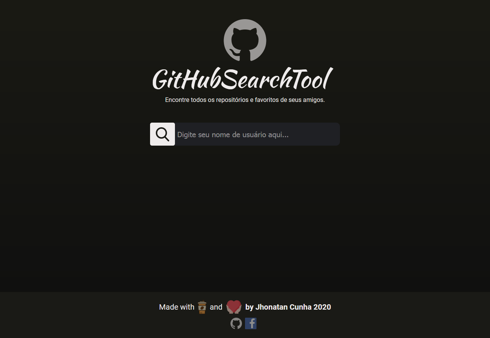

<h1 align="center">GitHub Search Tool<h1>
<p align="center">


</p>

<br>

## :ballot_box_with_check: Demo Live
- [Netlify - Clique Aqui](https://keen-mestorf-29e758.netlify.app/)


## :bookmark: Sobre


<p align="center">
    Projeto criado com intuito de aprender a consumir API de terceiros. Para desenhar a interface utilizei o Figma. 
</p>

<br>

# :computer: Web View

### :one: Fisrt Image
<p align="center">
    
</p>

### :two: Second Image
<p align="center">
    
</p>

### :three: Third Image
<p align="center">
    
</p>

### :four: Fourth Image
<p align="center">
    
</p>


# :iphone: Mobile View

<p align="center">
    
</p>


## 🚀 Tecnologias

- [ReactJS](https://pt-br.reactjs.org/)
- [Create React App](https://pt-br.reactjs.org/docs/create-a-new-react-app.html)
- [StoryBook](https://storybook.js.org/)
- [Styled-Components](https://styled-components.com/)

## ❓ Como utilizar?

### Instalação

```bash
$ cd api-github-search
$ yarn
$ yarn start
```

# :ballot_box_with_check: Icons

- [Instagram Icon](https://www.flaticon.com/free-icon/instagram_2111463?term=instagram&page=1&position=3)
- [GitHub Icon](https://www.flaticon.com/free-icon/github_2111425?term=github&page=1&position=1)
- [Love Icon](https://www.flaticon.com/free-icon/love_2913124?term=heart&page=1&position=3)
- [Coffee Icon](https://www.flaticon.com/free-icon/coffee_2836515?term=coffe&page=1&position=31)
- [Search Icon](https://www.flaticon.com/br/icone-gratis/procurar_149852?term=search&page=1&po)
- [Following Icon](https://www.flaticon.com/free-icon/same-interest_1999025?term=following&page=1&position=83sition=1)
- [Followers Icon](https://www.flaticon.com/free-icon/follower_2721516?term=followers&page=1&position=41)
- [Folder Icon](https://www.flaticon.com/free-icon/file_1179233?term=folder&page=1&position=36)
- [Favorite Icon](https://icons8.com/icon/80308/favorites)
- [Repository Icon](https://icons8.com/icon/set/repository/color)


<p align="center">
Made with :coffee: por :copyright: Jhonatan Cunha.
</p>
